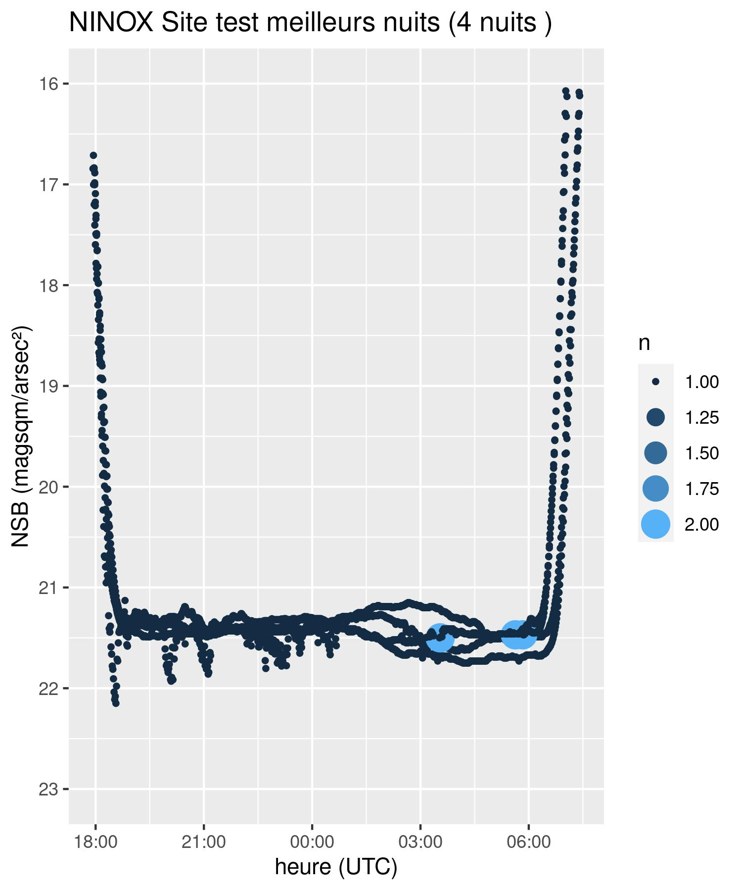
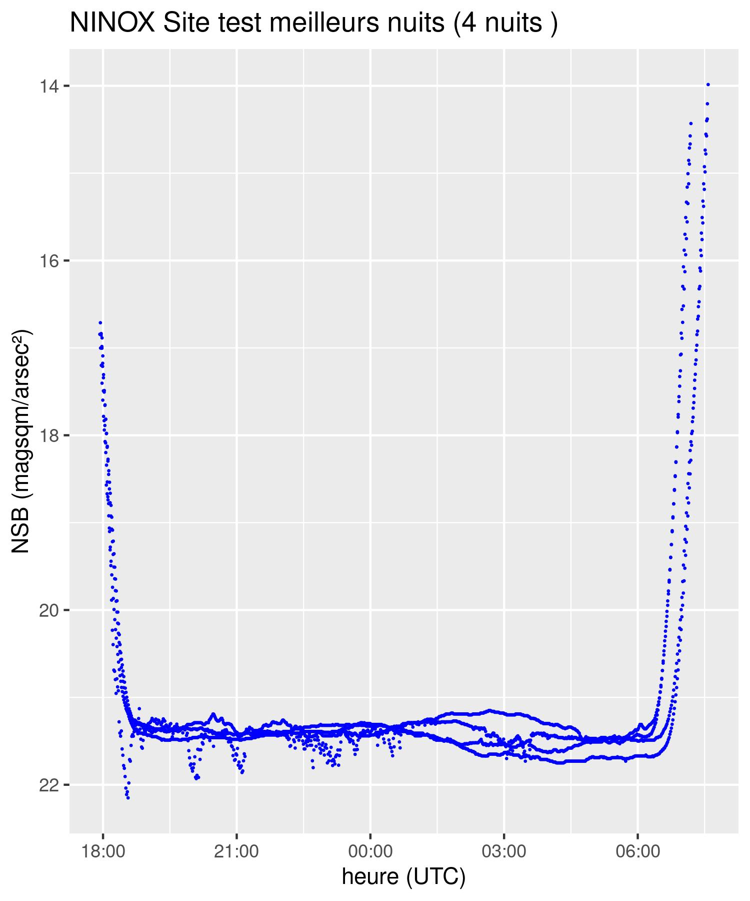
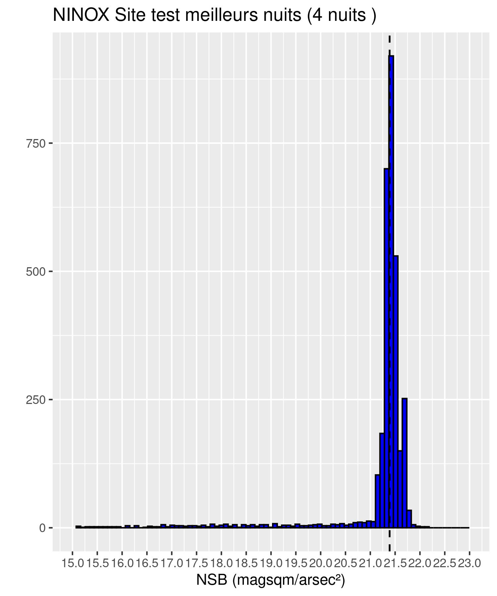
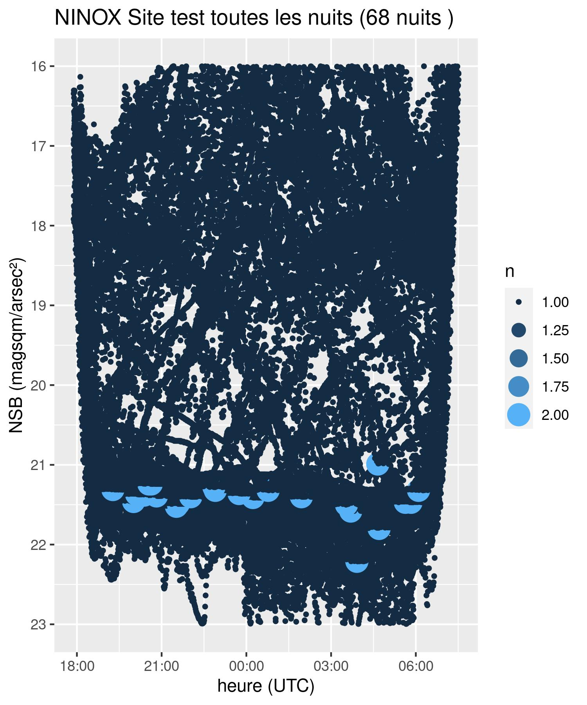
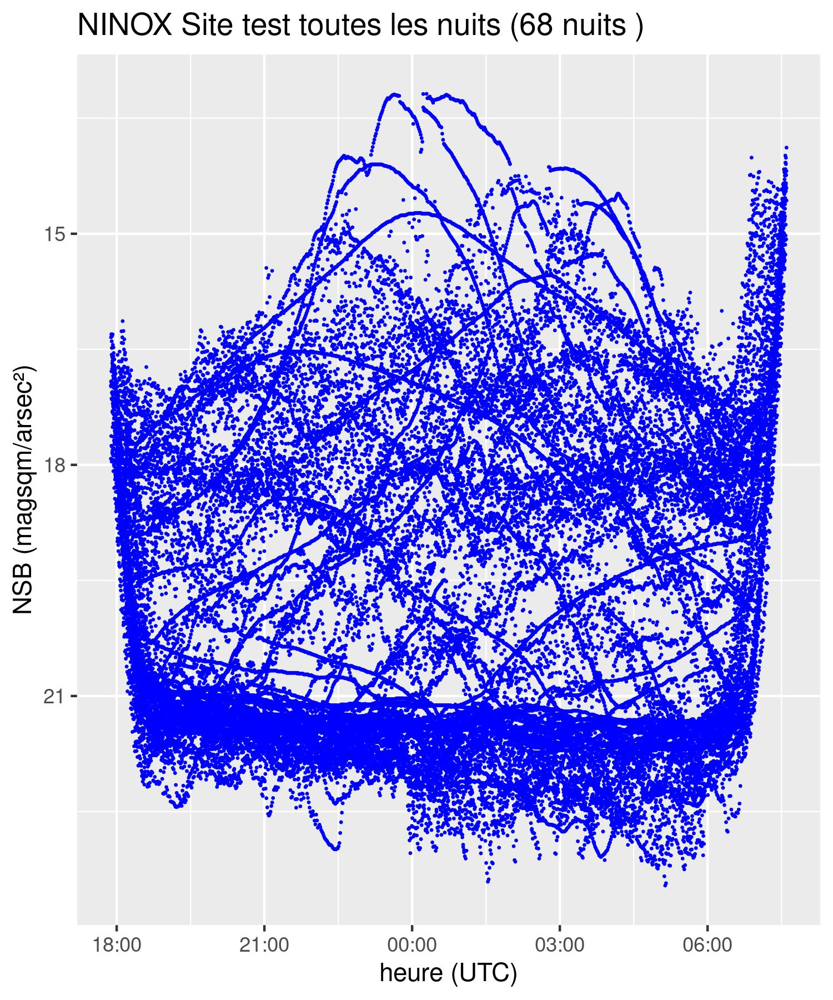
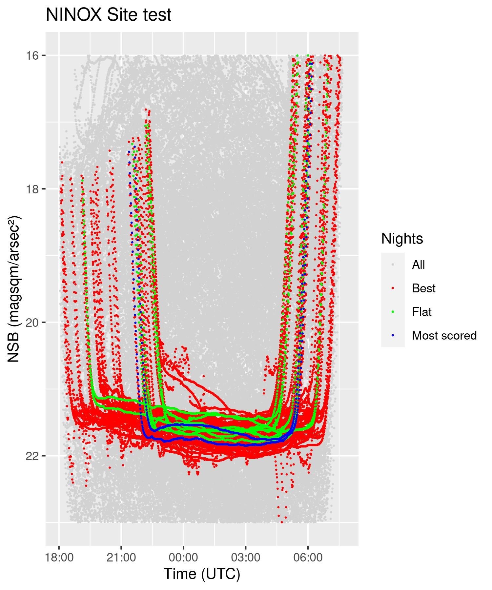
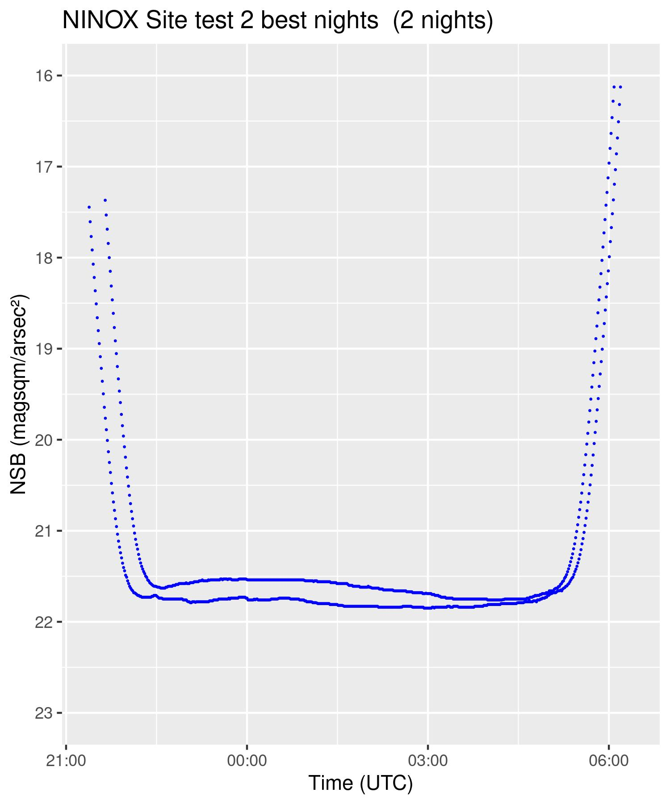

# Script R analyse capteurs NINOX
Script R d'analyse des capteurs NINOX permettant de mesurer la brillance du fond de ciel nocturne.
Ces capteurs sont souvent utilisés dans le cadre d'étude afin de caractériser la pollution lumineuse sur un site.
Ce script offre une première analyse des données issues de capteurs NINOX.
A partir d'un fichier de données, le script génère un rapport succinct des données et produit des graphiques.

# Non prises en compte de certaines valeurs du jeu de données
Pour la création des figures les valeurs d’altitude de la lune au moment de la mesure, de la phase de la lune et les valeurs de longitude et latitude galactique (position de la voie lactée au moment de la mesure) n'ont pas été prises en compte.

Les valeurs de la qualité du ciel sur les différents sites de mesures étant déja connu, l'extraction des meilleures nuits s'est basé sur ces différentes valeurs. Pour d'autres sites, une exploration des données et une modification des constantes seront surement nécessaires si la qualité du ciel n'est pas équivalente.

Pour la création des graphiques nous avons exclu les valeurs au dessous de 16 mag/arcsec² et les valeurs au dessus de 23 mag/arcsec².


# Préparation du jeu de données

Certaines données issues du système de mesure du boitier NINOX ne sont pas mesurées (exemple : "temp_ambiant" Température ambiante x 100 en °C (-10000 si inconnue)), ainsi ces colonnes ont été enlevées du jeu de données.

Pour pouvoir utiliser le fihcier et créer des graphiques, la transformation de la variable jd_utc (jour julien) en date au format yyyy_mm_dd_hh_mm_ss est nécessaire.
Afin d'avoir un graphique continu sur les différentes nuits (la nuit du 16 avril comprend des mesures sur le 16 et le 17 avril), une soustraction d'une journée est réalisée (sur les mesures du 17).

# résultats

Valeurs permettant de caractériser la qualité du site.
```
SITE : Site test
FICHIER : donnees_exemples/ninox_measure.csv
MEAN : 19.66
MEDIAN : 20.48
MODAL : 21.39
Number of days with measurements : 69
```
Ce script permet de réaliser :
- des histogrammes permettant de visualiser le nombre de mesures effectué et de visualiser le NSB de référence du site.
- des graphiques permettant de visualiser le profil des nuits mesurés (seulement avec les points ou coloré en fonction de la fréquence d'occurrence des valeurs)

Pour la totalité des données, pour les "bonnes nuits" et pour la meilleure nuit.


<p float="left">



</p>
<p float="left">



</p>

<p float="left">


</p>
# Extraction des "bonnes nuits"

L'extraction automatique des "meilleurs nuits" est réalisée avec la procédure suivante :

 * Extraction des données durant les périodes de nuits noires. Pour extraire ces données nous nous basons sur la valeur de l'altitude du soleil au moment de la mesure (x10 en degrés) qui doit être inférieure à -250
 * Récupération des jours où les valeurs de sqm_mag sont comprises entre 21 et 22.2 et où l'écart entre les deux valeurs ne dépasse pas 1 (constantes : MIN_SQM_MAG_VAL / MAX_SQM_MAG_VAL / DIFF_SQM_MAG)
 * Extraction de l'ensemble des valeurs dans le fichier d'origine des jours sélectionnés précédemment

Les valeurs ont été choisi de façon arbitraire et sont définies sous forme de constantes que l'on peut modifier lors des appels aux fonctions.

# extraction de la (ou les) meilleure nuit

L'extraction automatique de la meilleure nuit est réalisée avec la procédure suivante :

* Parmi les meilleures nuits sélectionnées préalablement, nous avons effectué un calcul permettant de sélectionner les nuits avec le profil le plus plat (constante : nb_flat_day)
* puis parmis ces nuits les plus plates, extraire celle qui a la valeur de NSB la plus élevé (constante : nb_best_day)
Le nombre de nuits plates et de meilleure nuit sélectionné sont définies sous forme de constantes que l'on peut modifier lors des appels aux fonctions.

# Utilisation du script
## Prerequis
Installer les packages R suivants :

```R
install.packages("lubridate")
install.packages("dplyr")
install.packages("ggplot2")
```


## Utilisation du script

Toutes les fonctions sont contenues dans le fichier `ninox_functions.R`. Il y a une une fonction principale qui peut être utilisée, ou il est possible d'appeler individuellement les fonctions.

```R
source("ninox_functions.R")

NOM_FICHIER <- "donnees_exemples/ninox_measure.csv"
NOM_SITE <- "Site test"

#########################
# Utilisation de la fonction globale
process_all(NOM_FICHIER, NOM_SITE)
```

```R
source("ninox_functions.R")

NOM_FICHIER <- "donnees_exemples/ninox_measure.csv"
NOM_SITE <- "Site test"

# Chargement et prétraitrement du fichier
all_data <- load_and_process_file(NOM_FICHIER)
# Selection des meilleurs nuits
best_night <- get_best_night(all_data)
# Modal
sqm_mag_mod <- get_modal_sqm_mag_value(all_data)
# Génération des graphiques
generate_graph(best_night, NOM_SITE, "meilleurs nuits", sqm_mag_mod)
generate_graph(all_data, NOM_SITE, "toutes les nuits", sqm_mag_mod)
```

# Constantes
Pour extraire les "meilleurs nuits" un ensemble de valeurs par défaut a été défini.

```R
# Altitude du soleil au moment de la mesure *10 en degré pour filtrer les données
SUN_ALT_MIN <- -250
# Valeur mininale de sqm_mag utilisée pour filtrer les données
MIN_SQM_MAG_VAL <- 21
# Valeur maximale de sqm_mag utilisée pour filtrer les données
MAX_SQM_MAG_VAL <- 22.2
# Différence maximale entre sqm_mag min et max par nuit utilisée pour filtrer les données
DIFF_SQM_MAG <- 1
```

Ces valeurs peuvent être changées lors de l'appel aux fonctions
```R
# Fonction globale
process_all(file_name, nom_site, sun_alt_min = SUN_ALT_MIN, diff_sqm_mag = DIFF_SQM_MAG, min_sqm_mag_val = MIN_SQM_MAG_VAL, max_sqm_mag_val = MAX_SQM_MAG_VAL)

# Fonction de calcul des "meilleurs nuits"
get_best_night(data_in, sun_alt_min = SUN_ALT_MIN, diff_sqm_mag = DIFF_SQM_MAG, min_sqm_mag_val = MIN_SQM_MAG_VAL, max_sqm_mag_val = MAX_SQM_MAG_VAL)
```
