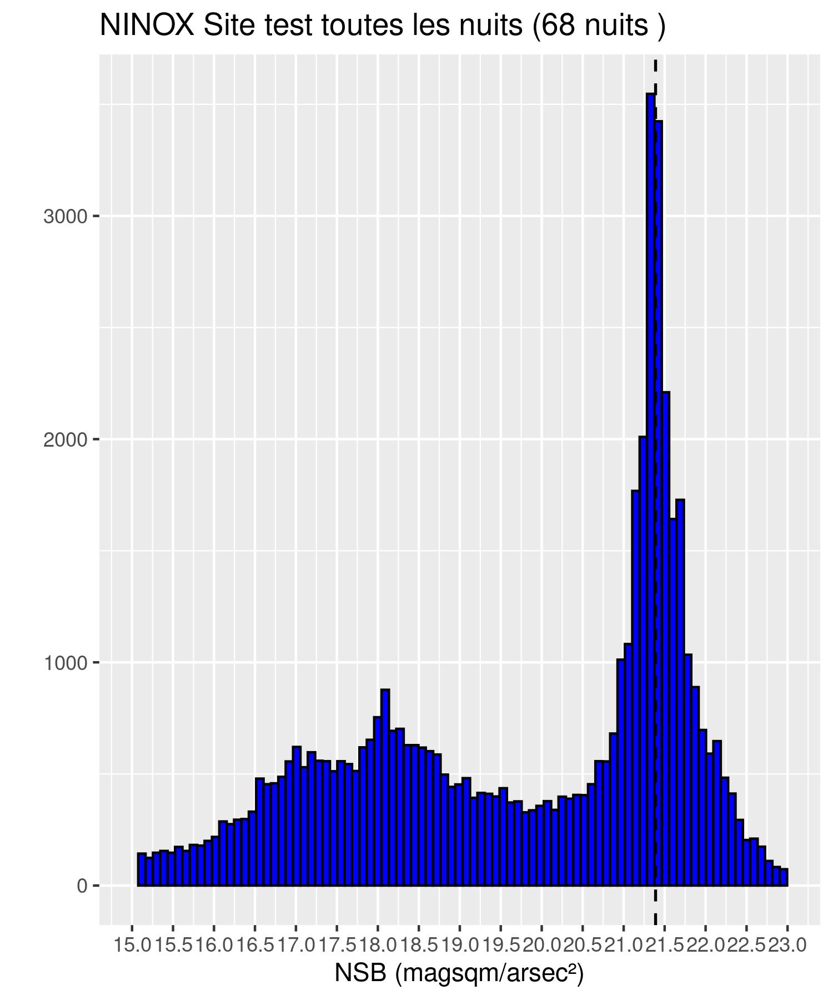

# Script R analyse capteurs NINOX
Script R d'analyse des capteurs NINOX permettant de mesurer la brillance du fond de ciel nocturne

# Résultats
Script offrant une première analyse des données issues de capteurs ninox.

A partir d'un fichier de données, le script génère un rapport succint des données, et produit des graphiques.

```
SITE : Site test
FICHIER : donnees_exemples/ninox_measure.csv
MEAN : 19.6627550706753
MEDIAN : 20.48
MODAL : 69
Nb de jours avec mesure : 69
```

Il offre une méthode d'extraction des "meilleurs nuits"

<p float="left">


</p>
<p float="left">



</p>


# Utilisation du script
## Prerequis
Installer les packages R suivants :

```R
install.packages("lubridate")
install.packages("dplyr")
install.packages("ggplot2")
```

# Constante
TODO

## Utilisation du script

Toutes les fonctions sont contenues dans le fichier `ninox_functions.R`. Il y a une une fonction principale qui peut être utilisée, ou il est possible d'appeler individuellement les fonctions.

```R
source("ninox_functions.R")

NOM_FICHIER <- "donnees_exemples/ninox_measure.csv"
NOM_SITE <- "Site test"

#########################
# Utilisation de la fonction globale
process_all(NOM_FICHIER, NOM_SITE)
```

```R
source("ninox_functions.R")

NOM_FICHIER <- "donnees_exemples/ninox_measure.csv"
NOM_SITE <- "Site test"

# Chargement et prétraitrement du fichier
all_data <- load_and_process_file(NOM_FICHIER)
# Selection des meilleurs nuits
best_night <- get_best_night(all_data)
# Modal
sqm_mag_mod <- get_modal_sqm_mag_value(all_data)
# Génération des graphiques
generate_graph(best_night, NOM_SITE, "meilleurs nuits", sqm_mag_mod)
generate_graph(all_data, NOM_SITE, "toutes les nuits", sqm_mag_mod)
```
